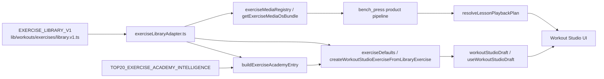

# Professional Workout Studio, Exercise Library, Exercise Academy & Exercise Media OS — Full Audit

**Audit date:** 2026-06-30  
**Auditor scope:** Repo truth only — no source changes made during this audit  
**Git working tree at audit time:** clean (`git status --short` empty)

---

## 1. Executive Summary

### What exists today

Oli has a **working Professional Workout Studio prototype** (`apps/professional`) as a separate Next.js workspace that shares the canonical consumer exercise catalog (`EXERCISE_LIBRARY_V1` in `lib/workouts/exercises/library.v1.ts`) via a thin adapter. The studio supports local-only workout authoring with blocks, per-set design, design/prescription/logging separation, Exercise Experience Studio (in-page, six tabs), Exercise Academy knowledge layer (469 derived entries + 20 intelligence seeds), and Exercise Media OS (typed blueprint/package/composer/timeline/readiness + Bench Press product pipeline + lesson playback prototype).

The consumer mobile app remains isolated: Expo/React Native at repo root; professional app is Next.js/web only.

### What is strong

| Area | Strength |
| --- | --- |
| **Architecture** | Clean separation: canonical library → adapter → academy → media OS → workout card. No Firestore in professional code. Strict TypeScript, discriminated unions, pure utilities. |
| **exerciseId preservation** | `WorkoutExerciseCard.exerciseId` holds canonical snake_case ids; adapter and tests enforce this. |
| **Workout Studio domain** | 16 block types, per-set designer, volume projection, intelligence-backed volume attribution (top 20), quality checklist, client preview. |
| **Media OS types** | Comprehensive Sprint M1–M7 model surface: blueprint, slots, master package, composer, timeline, readiness, asset manifest, playback plan. |
| **Bench Press pilot** | End-to-end product pipeline: storyboard, production brief (prompts, constraints, acceptance criteria), expert QA checklist, playback with graceful placeholder fallback. |
| **Tests (professional)** | 14 suites / 164 tests — all passing. Critical pure logic covered. |
| **Docs** | `docs/professional-platform/Exercise Media OS Architecture v1.md` and README align well with code. |

### What is fragile

| Area | Fragility |
| --- | --- |
| **Media readiness semantics** | Bench Press master package marks all 8 slots `status: "approved"` while asset manifest marks all videos `status: "missing"`. Readiness score reports `ready` / score ≥ 90 based on **slot metadata**, not playable assets. |
| **Video-first assumptions** | Slots, playback, asset types, and production briefs are video-centric. `ExerciseMediaAssetType` includes `image` but no keyframe set, character, or image-pack workflow exists. |
| **Academy teaching depth** | 449/469 exercises get **heuristic** teaching from library metadata — not expert-authored content. Substitutions/regressions empty unless intelligence seed exists. |
| **Exercise library metadata** | Canonical `ExerciseLibraryItemV1` lacks plane of motion, bilateral/unilateral, ROM definitions, contraindications, progressions, media requirements, etc. |
| **Bench Press only** | Media registry, playback plan, and product pipeline are hard-gated to `bench_press`. |
| **No persistence** | All studio state is in-memory React context — lost on refresh. |
| **Root CI tests** | `npm run test` fails in sandbox without Firestore emulator network (`Port 60077 not ready within 30000ms`). Passes with network (705 suites / 4301 tests). |

### Image-first readiness

**Not ready.** The repo has placeholder `image` asset type and aspect ratio enums (`16:9`, `9:16`, `1:1`) but **no** Character Registry, Keyframe Spec, Image Candidate Review, Approved Master Image Pack, or image-to-video lineage models. CSS `@keyframes` in stylesheets are unrelated to exercise keyframes.

**Recommendation:** Proceed image-first strategically. Current Media OS types are a solid foundation to extend — not replace.

### Overall readiness score: **4.8 / 10** (world-class exercise library + media production system)

| Subsystem | Score |
| --- | --- |
| Exercise Library | 4.0 / 10 |
| Exercise Academy | 5.5 / 10 |
| Workout Studio | 6.5 / 10 |
| Media OS | 5.0 / 10 |
| Image-first / keyframe | 1.5 / 10 |
| Bench Press pilot | 5.5 / 10 |
| Testing / code quality | 7.5 / 10 |

---

## 2. Current System Map

### Apps / workspaces

| Workspace | Path | Role |
| --- | --- | --- |
| **Consumer (Expo)** | repo root (`app/`, `components/`, `lib/`) | Mobile health OS — assessment, baseline, target state, workout logging |
| **@oli/professional** | `apps/professional/` | Next.js 15 professional creative studio |
| **@oli/contracts** | `lib/contracts/` | Shared Zod contracts |
| **api** | `services/api/` | Cloud Run API |
| **functions** | `services/functions/` | Firebase functions |

Root `package.json` workspaces: `lib/contracts`, `services/api`, `services/functions`, `apps/professional`.

Root `tsconfig.json` references: `lib`, `app`, `services/functions`, `services/api` — **not** professional (professional has own `tsconfig.json`).

### Professional routes (verified)

| Route | File |
| --- | --- |
| `/` | `apps/professional/src/app/page.tsx` |
| `/login` | `apps/professional/src/app/login/page.tsx` |
| `/dashboard` | `apps/professional/src/app/dashboard/page.tsx` |
| `/clients` | `apps/professional/src/app/clients/page.tsx` |
| `/clients/[id]` | `apps/professional/src/app/clients/[id]/page.tsx` |
| `/studio/workouts` | `apps/professional/src/app/studio/workouts/page.tsx` |
| `/studio/workouts/new` | `apps/professional/src/app/studio/workouts/new/page.tsx` |
| `/unauthorized` | `apps/professional/src/app/unauthorized/page.tsx` |

**Main authoring route:** `/studio/workouts/new` (optionally `?workoutId=`)

`next build` output confirms all routes; `/studio/workouts/new` is 64.1 kB page bundle.

### Important feature directories

```
apps/professional/src/features/
├── workout-studio/          # Draft state, adapter, volume, defaults, preview
├── exercise-academy/        # Academy entry builder, intelligence, lesson modules
└── exercise-media-os/       # Blueprint, packages, bench press product, playback
    ├── bench-press-product/
    ├── data/
    └── playback/

lib/workouts/exercises/
├── library.v1.ts            # EXERCISE_LIBRARY_V1 (469 exercises)
├── catalog.ts               # Picker eligibility
├── metadata.ts              # Derived meta + generic cues
├── muscleContributions.ts   # Mobile analytics contributions
└── classifications*.ts      # Evidence-based classification
```

### Data flow (current)



### Consumer foundation (verified)

| Engine | Location | Status |
| --- | --- | --- |
| Health Assessment v1 | `lib/data/health-assessment/` | Session in-memory store; routes in `app/(app)/profile/health-assessment.tsx` |
| Health Baseline v1 | `lib/data/health-baseline/` | Client-computed; `HealthBaselineScreen` |
| Classification Framework v1 | `lib/classifications/`, `docs/authoritative/Oli Evidence-Based Classification Framework v1.md` | Types + registry |
| Target State v1 | `lib/data/target-state/` | Client-computed; `app/(app)/profile/target-state.tsx` |

Professional portal references these conceptually on client page (`Target State` label) but does not consume live assessment/baseline APIs yet.

### Duplicate / legacy systems

| Item | Notes |
| --- | --- |
| `WorkoutSection` / `WORKOUT_SECTION_KINDS` | Deprecated aliases for `WorkoutBlock` — still exported |
| `EXERCISE_CATALOG_V1` vs `EXERCISE_LIBRARY_V1` | Parallel arrays; test asserts same length/ids — library is source of truth |
| Academy `ExerciseMediaPlan` vs Media OS `ExerciseMediaBlueprint` | Two media slot vocabularies (`hero-demo` kebab vs `heroDemo` camel) — intentional layering per docs |
| `dist/` at repo root | Build artifacts — not source of truth |

### Docs vs code

| Doc | Alignment |
| --- | --- |
| `docs/professional-platform/Exercise Media OS Architecture v1.md` | **Aligned** — matches types, bench press pilot, composer |
| `docs/professional-platform/Exercise Academy Architecture v1.md` | **Mostly aligned** — runtime entries are computed, not static JSON |
| `apps/professional/README.md` | **Aligned** — routes, local-only, no backend |
| `docs/professional-platform/Professional Portal Readiness Audit v1.md` | **Partially stale** — predates Media OS M4–M7 completion |

---

## 3. Exercise Library Readiness

**Score: 4.0 / 10**

### Canonical source

**File:** `lib/workouts/exercises/library.v1.ts`  
**Export:** `EXERCISE_LIBRARY_V1`  
**Count:** **469** exercises (verified via `rg -c "exerciseId:"` and `exerciseLibraryV1.test.ts` ≥450 gate)  
**All active** in picker (`CONFIRMED_UNUSED_BUNDLED_EXERCISE_IDS` is empty)

### `ExerciseLibraryItemV1` fields (actual)

| Field | Present |
| --- | --- |
| `exerciseId` | ✅ snake_case, unique |
| `name` | ✅ |
| `aliases` | ✅ |
| `equipment` | ✅ |
| `equipmentSubtype` | ✅ optional |
| `primaryBucket` | ✅ |
| `movement` | ✅ (movement pattern) |
| `trainingType` | ✅ |
| `primaryCoarse` / `secondaryCoarse` | ✅ |
| `primaryDetailed` / `secondaryDetailed` | ✅ |
| `cues` | ✅ optional |
| `description` | ✅ optional |
| `status` | ✅ active/archived/retired |
| `successorExerciseId` | ✅ optional |

### World-class target — missing at canonical level

| Missing field | Notes |
| --- | --- |
| `displayName` | Uses `name` only |
| `planeOfMotion` | Only in intelligence overlay (20 exercises) |
| `bodyRegion` | Derived from `primaryBucket` only |
| `bilateral` / `unilateral` | ❌ |
| `openChain` / `closedChain` | ❌ |
| `setupPosition` / `startPosition` / `endPosition` | ❌ |
| `rangeOfMotionDefinition` | ❌ |
| `tempoDefaults` | ❌ |
| `contraindications` | ❌ |
| `regressions` / `progressions` / `substitutions` | ❌ in library (empty in academy defaults) |
| `coachingCues` (structured) | Flat `cues[]` only |
| `commonMistakes` / `feelCues` / `safetyNotes` | In academy heuristics only |
| `programmingUseCases` | Intelligence only (20) |
| `mediaRequirements` / `keyframeRequirements` | ❌ |
| `difficulty` | Inferred in academy, not library |

### Professional adapter

**File:** `apps/professional/src/features/workout-studio/exerciseLibraryAdapter.ts`

- Pure filter/map over `EXERCISE_LIBRARY_V1`
- `WorkoutLibraryExercise` maps coarse muscles, equipment, movement, etc.
- **Tested** in `workoutStudioDraft.test.ts` (`describe("exerciseLibraryAdapter")`)
- **No dedicated adapter test file** — covered inside draft tests

### exerciseId preservation

| Check | Status |
| --- | --- |
| Library add preserves `exerciseId` | ✅ `createWorkoutStudioExerciseFromLibraryExercise` |
| Payload export | ✅ `buildAppWorkoutDraftPayload.ts` |
| Media OS keys by `exerciseId` | ✅ |
| Bench press canonical id | ✅ `bench_press` everywhere |

### Duplicated truth risks

| Risk | Severity |
| --- | --- |
| `metadata.ts` generic cues when library row lacks cues | P2 — fallback behavior |
| `muscleContributions.ts` separate from library | P2 — mobile analytics path |
| Academy teaching heuristics duplicate library cues | P1 — may drift from expert truth |
| Intelligence seeds duplicate muscle lists | P2 — intentional overlay |

### Recommended future library location

Extend via **additive** types alongside `library.v1.ts`:

- `lib/workouts/exercises/libraryEnrichment.v1.ts` (or academy-owned overlays)
- Do **not** replace `EXERCISE_LIBRARY_V1` rows — add enrichment map keyed by `exerciseId`

---

## 4. Exercise Academy Readiness

**Score: 5.5 / 10**

### Core types

**File:** `apps/professional/src/features/exercise-academy/types.ts`

`ExerciseAcademyEntry` includes: `identity`, `biomechanics`, `teaching`, `mediaPlan`, `programming`, `safety`, `substitutions`, `quality`.

### Coverage

| Layer | Count | Source |
| --- | --- | --- |
| Academy entries | **469** (on demand) | `buildExerciseAcademyEntryFromCanonicalExercise` |
| Intelligence overlay | **20** | `data/top20ExerciseAcademyIntelligence.ts` |
| Skipped intelligence ids | 2 | `split_squat`, `bulgarian_split_squat` (not in library — tests use `split_squat_dumbbell`, `bulgarian_split_squat_dumbbell`) |

### Domain coverage matrix

| Domain | Coverage |
| --- | --- |
| Identity | ✅ From library |
| Biomechanics | ⚠️ Heuristic (`buildBiomechanicsFromLibrary`) |
| Teaching | ⚠️ Heuristic (`buildTeachingFromLibrary`) — generic for most |
| Programming | ⚠️ Heuristic |
| Safety | ✅ Template strings |
| Substitutions | ❌ Empty arrays unless intelligence seed |
| mediaPlan | ✅ All slots `planned` / `missing` |
| quality | ✅ Scored via `buildExerciseKnowledgeQuality` |

### Bench Press

- Library row: full metadata
- Academy entry: deterministic 8 lesson modules (Overview → Reflection) — tested
- Intelligence: full seed with stabilizers, joint considerations, movement analysis
- Default coaching: `buildAcademyBackedExerciseDesignDefaults` → `createDefaultExerciseDetails`

### Powers coaching / media today

| Consumer | Usage |
| --- | --- |
| `exerciseDefaults.ts` | Seeds design + progression on library add |
| `buildWorkoutVolumeAttribution.ts` | Primary/secondary/stabilizers/joint stress from intelligence |
| `buildBenchPressMediaStoryboard.ts` | Academy + intelligence for bench press scenes |
| `ExerciseLessonTab.tsx` | Lesson modules from academy |
| `ExerciseCoachingTab` | Design fields seeded from academy |

### Gaps

1. Academy is **not yet truth layer** for media blueprints — Media OS has separate slot model
2. No expert QA criteria at academy level (only bench press product pipeline)
3. 449 exercises lack intelligence — volume attribution falls back to taxonomy-only primary
4. `reviewStatus: "draft"` on all intelligence seeds

### Should Academy become truth layer?

**Yes, long-term** for: coaching content, lesson modules, media blueprint requirements, QA criteria, keyframe requirements, production briefs.

**Current state:** Partial — teaching heuristics + 20 expert seeds. Media requirements live in Media OS, not Academy.

---

## 5. Workout Studio Readiness

**Score: 6.5 / 10**

### Main authoring route

`/studio/workouts/new` → `NewWorkoutStudioPageContent.tsx` (285 lines)

Three-column layout: Library | Author Canvas | Navigator + optional Client Preview overlay + in-page Exercise Experience Studio.

### Draft state

```ts
// workoutStudioDraft.ts
WorkoutStudioDraftState { workouts: WorkoutExperience[], activeWorkoutId }
WorkoutExperience { id, title, clientName, overview, blocks[], difficulty, ... }
WorkoutBlock { id, blockType, customTitle, notes, order, exercises[] }
WorkoutExerciseCard { id, exerciseId, source, designedSets[], design, prescription, logging, mediaComposer, ... }
```

**Storage:** `useWorkoutStudioDraft.tsx` — React context, in-memory only.

### Design / prescription / logging separation

| Layer | Type | Location on card |
| --- | --- | --- |
| Design / education | `ExerciseDesignFields` | `design` |
| Prescription | `ExercisePrescriptionFields` + `designedSets[]` | `prescription` + `designedSets` (primary) |
| Logging schema | `ExerciseLoggingSchema` | `logging` |

✅ Cleanly separated in `types.ts`.

### Per-set designer

- **Type:** `WorkoutDesignedSet` — reps, repRange, loadGuidance, RPE, RIR, rest, tempo, notes
- **Utils:** `designedSetUtils.ts` — add/duplicate/remove/move/apply-to-all
- **UI:** `ExerciseSetsTab.tsx`
- **Tests:** `workoutStudioDraft.test.ts`, `exerciseCard.test.ts`
- **Default:** 3 sets, 8-12 reps, RPE 8, RIR 2, 90s rest

### Projected volume

- **Primary-only attribution:** `buildWorkoutProjectedVolume.ts` — strength blocks only
- **Intelligence attribution:** `buildWorkoutVolumeAttribution.ts` — primary + secondary + stabilizers + joint stress
- **Tests:** `workoutVolumeAttribution.test.ts`
- **UI:** `ProjectedVolumeCard.tsx` with detail modal

### Block / exercise operations

| Operation | Function | Tested |
| --- | --- | --- |
| Add/update/remove/duplicate/move block | `workoutStudioDraft.ts` | ✅ |
| Add from library / custom | `addExerciseFromLibrary`, `addCustomExercise` | ✅ |
| Update/remove/duplicate/move exercise | ✅ | ✅ |
| Move exercise to block | `moveExerciseToBlock` | ✅ |
| Clone exercise | `exerciseCloneUtils.ts` | ✅ |

### Exercise Experience Studio

- **In-page overlay** — not a separate route
- **Tabs:** Sets, Media, Lesson, Coaching, Progression, Tracking
- **Live preview:** `ExerciseExperienceLivePreview.tsx`
- **Lesson playback:** `LessonPlaybackModal` — bench press only

### Client preview

`ClientExperiencePreviewPanel.tsx` — slide-over from `buildWorkoutExperiencePreview` — shows blocks, sets, why/how/cues; does **not** embed full media playback timeline.

### UX / product gaps (top)

1. No workout save/publish — "Local draft" badge only
2. Client preview doesn't show media lesson experience
3. Library is flat search/filter — no curated collections or "Oli essentials"
4. No undo/redo
5. Exercise Experience Studio is powerful but dense — high cognitive load for first visit
6. Non-bench exercises show planned media only — no playback CTA

### Technical debt

| Item | File | Note |
| --- | --- | --- |
| `NewWorkoutStudioPageContent` orchestration | 285 lines | Acceptable but growing |
| Deprecated section aliases | `types.ts` | P3 cleanup later |
| No exercise library adapter standalone test file | — | P2 |

---

## 6. Media OS Readiness

**Score: 5.0 / 10**

### Types (verified `types.ts`)

✅ `ExerciseMediaBlueprint`, `MediaSlot`, `MasterMediaPackage`, `MediaComposerState`, `ClientMediaTimeline`, `MediaReadinessScore`, `ExerciseMediaAsset`, aspect ratios, teaching styles, slot types.

### Pipeline (current)

```
buildExerciseMediaBlueprint(exerciseId)
  → buildPlannedMasterMediaPackage OR buildBenchPressPilotMasterMediaPackage
  → buildMediaComposerState
  → buildClientMediaTimeline
  → buildMediaReadinessScore
  → (bench_press only) buildBenchPressExerciseProductPipeline
  → resolveLessonPlaybackPlan
```

**Registry:** `exerciseMediaRegistry.ts` → `getExerciseMediaOsBundle(exerciseId)`

### Bench Press pilot

| Artifact | File |
| --- | --- |
| Master package | `data/benchPressMasterMediaPackage.ts` |
| Asset manifest | `data/benchPressMediaAssets.ts` |
| Storyboard | `bench-press-product/buildBenchPressMediaStoryboard.ts` |
| Production brief | `bench-press-product/buildBenchPressProductionBrief.ts` |
| QA checklist | `bench-press-product/buildBenchPressExpertMediaQAChecklist.ts` |
| Pipeline | `bench-press-product/buildBenchPressExerciseProductPipeline.ts` |

**8 slots:** coachIntro, heroDemo, setup, execution, commonMistake, slowMotion, muscleOverlay, reflection

### Asset manifest vs slots

| Layer | Bench Press status |
| --- | --- |
| Master package slots | All `approved` |
| Asset manifest (`benchPressMediaAssets.ts`) | All `missing` |
| Public files | **Only** `README.md` — no `.mp4` committed |
| Playback | Placeholder surfaces unless manifest status manually set to `approved` + file exists |

**Path:** `/media/exercises/bench_press/hero-demo.mp4` → `apps/professional/public/media/exercises/bench_press/hero-demo.mp4`

### Orientation: video-first

- Slot `outputFormats`: `mp4`, `webm`, `hls`
- Playback: HTML `<video>` only (`LessonPlaybackPlayer.tsx`)
- Production brief: `aiGenerationPrompt` for video clips
- Image type exists on `ExerciseMediaAsset` but unused in pipeline

### Render targets

`MediaAssetAspectRatio`: `16:9`, `9:16`, `1:1` — **typed but not used** in bench press manifest (all `16:9`).

### Asset status model (actual)

**MediaSlotStatus:** `missing` | `planned` | `draft` | `reviewed` | `approved`  
**ExerciseMediaAssetStatus:** `missing` | `draft` | `reviewed` | `approved`

**Missing statuses:** `dev-test`, `needs-revision`, `rejected`, `approved-master`, `superseded`

### Other gaps

| Capability | Status |
| --- | --- |
| Candidate review UI | ❌ |
| Prompt version tracking | ❌ (brief has inline prompts only) |
| Source/tool tracking | Partial (`source` field on assets) |
| Rights / licensing | ❌ |
| QA notes persistence | ❌ (checklist defaults `not-reviewed`) |
| Biomechanical QA scoring | ❌ (checklist items, no scores) |
| Image-to-video lineage | ❌ |
| Character consistency | ❌ |
| Multi-exercise registry | ❌ bench_press only |

### Playback audit summary

| Question | Answer |
| --- | --- |
| Storyboard-driven? | ✅ Bench press pipeline scenes |
| Deterministic transitions? | ✅ `buildLessonPlaybackProgress.ts` |
| Progress tested? | ✅ `lessonPlayback.test.ts` |
| Missing asset fallback? | ✅ Placeholder gradient + labels |
| Placeholder vs approved exposed? | ⚠️ Label only — slot `approved` vs asset `missing` not distinguished in UI |
| Accessible? | ⚠️ Modal + play overlay; video controls native |
| Non-bench exercises? | ❌ `resolveLessonPlaybackPlan` returns null |
| Image sequence ready? | ❌ |

---

## 7. Image-First / Keyframe-First Readiness

**Score: 1.5 / 10**

### Future model vs repo

| Model | Status | Existing partial support |
| --- | --- | --- |
| **Character Registry** | ❌ Missing | — |
| **Exercise Keyframe Spec** | ❌ Missing | Production brief `shotList` / `acceptanceCriteria` per scene (video-oriented) |
| **Image Candidate Review** | ❌ Missing | `BlueprintReviewStatus`, slot `reviewed` status |
| **Approved Master Image Pack** | ❌ Missing | `MasterMediaPackage` could extend |
| **Future Video Package** | ❌ Missing | `ExerciseMediaAsset`, negative prompts in brief |

### Recommended repo locations (do not implement yet)

```
apps/professional/src/features/exercise-media-os/
├── character-registry/
│   ├── types.ts              # OliCharacter, CharacterRegistryEntry
│   └── characterRegistry.ts
├── keyframe-spec/
│   ├── types.ts              # ExerciseKeyframeSpec, KeyframeView, LandmarkSpec
│   └── buildExerciseKeyframeSpec.ts
├── candidate-review/
│   ├── types.ts              # ImageCandidate, CandidateReviewStatus, QAScore
│   └── buildCandidateReviewState.ts
├── image-pack/
│   ├── types.ts              # ApprovedMasterImagePack, KeyframeAsset
│   └── buildApprovedImagePack.ts
└── video-from-images/
    ├── types.ts              # VideoFromImagePackSpec, MotionRequirement
    └── buildVideoPackageSpec.ts
```

### Proposed type names (strict TS)

```ts
type CandidateReviewStatus =
  | "missing"
  | "draft"
  | "dev-test"
  | "needs-revision"
  | "rejected"
  | "approved-master"
  | "superseded";

type OliCharacterId = "oli_motion_male_m1" | "oli_motion_female_f1"; // future union

type ExerciseKeyframeSpec = {
  exerciseId: string;
  keyframeSetId: string;
  keyframeVersion: string;
  characterId: OliCharacterId;
  requiredViews: readonly KeyframeView[];
  poses: KeyframePoseSet;
  acceptanceCriteria: readonly string[];
  negativeCriteria: readonly string[];
};
```

### Tests needed (future)

- Keyframe spec validation per exercise
- Candidate status transitions
- Image pack completeness scoring
- Image sequence playback plan builder
- Character lock consistency rules

### Risks if skipping image-first foundation

- P0: Another round of video generation with accuracy failures
- P0: No review workflow — cannot scale production
- P1: Professional UI stays video-upload-shaped mentally

---

## 8. Bench Press Pilot Readiness

**Score: 5.5 / 10**

### Canonical exerciseId

✅ `bench_press` — `BENCH_PRESS_PILOT_EXERCISE_ID`, library row, intelligence seed, sample workout.

### Alignment with library

✅ Name, muscles, equipment, movement pattern consistent across library → adapter → academy → media OS.

### Slots — all metadata-approved, all assets missing

| Slot | Video file | Asset status |
| --- | --- | --- |
| coachIntro | `coach-intro.mp4` | missing |
| heroDemo | `hero-demo.mp4` | missing |
| setup | `setup.mp4` | missing |
| execution | `execution.mp4` | missing |
| commonMistake | `common-mistake.mp4` | missing |
| slowMotion | `slow-motion.mp4` | missing |
| muscleOverlay | `muscle-overlay.mp4` | missing |
| reflection | `reflection.mp4` | missing |

### Missing asset behavior

✅ No errors — placeholder UI with "Storyboard preview — asset pending production"

### Video load failure

✅ `onError` → `setVideoLoadError(true)` → falls back to placeholder (`LessonPlaybackPlayer.tsx`)

### dev-test vs approved-master

❌ Not distinguishable — only `approved` on assets; no `dev-test` status.

### Pipeline contents

| Item | Present |
| --- | --- |
| Storyboard | ✅ |
| Production brief | ✅ |
| Narration scripts | ✅ |
| Shot list | ✅ |
| Overlay plan | ✅ |
| AI prompts | ✅ |
| Negative prompts | ✅ (`SHARED_NEGATIVE_PROMPT`) |
| Biomechanics constraints | ✅ |
| Acceptance criteria | ✅ (per scene) |
| QA checklist | ✅ (defaults `not-reviewed`) |

### Hero Demo QA standard (chat context vs code)

| Criterion | In code/docs? |
| --- | --- |
| Exactly one full rep | ❌ Not explicit |
| No second rep / half rep | ❌ |
| Full bench, barbell, plates, feet visible | ⚠️ Implied in shot list framing |
| Stable camera | ✅ `SHARED_CAMERA`, shot list |
| Clear bar path | ✅ constraints + overlay |
| Bar touches lower chest/sternum | ⚠️ "light chest touch" in narration |
| Brief pause on chest | ❌ |
| Smooth press, wrists stacked, elbows moderate, feet planted | ⚠️ Partial in constraints |
| No bounce | ✅ acceptance + negative prompt |
| No warped barbell / distorted hands / impossible anatomy | ✅ negative prompt |
| No watermark | ❌ |
| Clear on mobile | ✅ acceptance criteria |
| Premium Oli visual style | ✅ `SHARED_CAMERA` |

**Verdict:** Partial overlap in `buildBenchPressProductionBrief.ts` — **not** the full Hero Demo QA standard as a dedicated checklist. Exists only as scattered prompts/constraints, not as codified `heroDemo` acceptance block matching the audit standard.

### Tests

✅ `benchPressExerciseProductPipeline.test.ts`, `exerciseMediaOs.test.ts`, `mediaAssetRegistry.test.ts`, `lessonPlayback.test.ts`

---

## 9. Testing / Code Quality

### Commands run

| Command | Result | Notes |
| --- | --- | --- |
| `npm run typecheck` | ✅ PASS | `tsc -b` |
| `npm run lint` | ✅ PASS | root eslint |
| `npm run test -- --ci --runInBand` | ❌ FAIL (sandbox) | Firestore emulator port timeout |
| `npm run test -- --ci --runInBand` | ✅ PASS (network) | 705 suites, 4301 tests |
| `npm --workspace @oli/professional run typecheck` | ✅ PASS | |
| `npm --workspace @oli/professional run lint` | ✅ PASS | |
| `npm --workspace @oli/professional run test` | ✅ PASS | 14 suites, 164 tests |
| `npm --workspace @oli/professional run build` | ✅ PASS | Next.js 15.5.19 |

### Professional test files (14)

```
apps/professional/src/features/workout-studio/__tests__/
  workoutStudioDraft.test.ts
  exerciseCard.test.ts
  exerciseExperienceWorkspace.test.ts
  workoutVolumeAttribution.test.ts
  workoutDesignerLayout.test.ts
  workoutStudioLayout.test.ts
apps/professional/src/features/exercise-academy/__tests__/
  exerciseAcademy.test.ts
  exerciseAcademyIntelligence.test.ts
apps/professional/src/features/exercise-media-os/__tests__/
  exerciseMediaOs.test.ts
  mediaAssetRegistry.test.ts
apps/professional/src/features/exercise-media-os/playback/__tests__/
  lessonPlayback.test.ts
apps/professional/src/features/exercise-media-os/bench-press-product/__tests__/
  benchPressExerciseProductPipeline.test.ts
apps/professional/src/components/workout-studio/exercise-card/__tests__/
  exerciseExperienceBuilderUi.test.ts
  mediaLessonDirectorUi.test.ts
```

### Tested vs untested (critical)

| Logic | Tested? |
| --- | --- |
| exerciseLibraryAdapter | ✅ (in draft tests) |
| exerciseId preservation | ✅ |
| workout draft reducers | ✅ |
| block/exercise move/duplicate/remove | ✅ |
| per-set designer utils | ✅ |
| volume attribution (intelligence) | ✅ |
| academy defaults | ✅ |
| media readiness score | ✅ |
| asset manifest resolution | ✅ |
| playback progress | ✅ |
| bench press pipeline | ✅ |
| keyframe spec validation | ❌ N/A |
| candidate review scoring | ❌ N/A |
| `buildWorkoutProjectedVolume` standalone | ⚠️ Used in draft tests indirectly |
| React component integration tests | ❌ UI logic tested via pure utils only |
| Snapshot tests | ❌ None |

### Code quality

- **No `any` type** in professional `*.ts`/`*.tsx` (grep hits are English word "any")
- **strict: true**, **noUncheckedIndexedAccess: true** in professional tsconfig
- **No react-native imports** in professional production code (enforced by tests)
- **No Firestore** in professional feature code

### Great Code Standard violations

| Issue | Severity |
| --- | --- |
| Readiness score conflates slot approval with asset readiness | P1 |
| Dual media slot vocabularies (Academy kebab vs Media OS camel) | P2 |
| `LessonPlaybackScene.slotType: string` (loose) | P3 |

---

## 10. P0/P1/P2/P3 Risk Register

| ID | Title | Sev | File(s) | Current behavior | Why it matters | Recommended fix | Fix type | Backend? |
| --- | --- | --- | --- | --- | --- | --- | --- | --- |
| R-01 | Slot approval ≠ asset approval | P0 | `benchPressMasterMediaPackage.ts`, `buildMediaReadinessScore.ts` | Slots `approved`, assets `missing`, readiness `ready` | False production confidence | Split slot planning status from asset production status; readiness uses assets | code + tests | No |
| R-02 | No keyframe/image production model | P0 | `exercise-media-os/types.ts` | Video-only pipeline | Blocks image-first strategy | Sprint M9 keyframe + character types | code + tests + docs | No |
| R-03 | No candidate review workflow | P0 | — | QA checklist static `not-reviewed` | Cannot scale media factory | Sprint M10 review UI + statuses | code + tests | No |
| R-04 | Academy teaching is heuristic for 449 exercises | P1 | `exerciseAcademyDefaults.ts` | Generic copy | Trust/accuracy for world-class library | Enrichment plan for top 25-50 | data + docs | No |
| R-05 | Canonical library missing biomechanics fields | P1 | `library.v1.ts` | Minimal metadata | Cannot drive accurate keyframes/QA | Add enrichment layer keyed by exerciseId | types + data | No |
| R-06 | Bench-press-only media registry | P1 | `mediaAssetRegistry.ts` | Returns `[]` for other exercises | Blocks multi-exercise rollout | Generalize registry pattern | code + tests | No |
| R-07 | No workout persistence | P1 | `useWorkoutStudioDraft.tsx` | In-memory only | Professionals lose work | LocalStorage draft sprint (later API) | code | Later yes |
| R-08 | Hero Demo QA standard not codified | P1 | `buildBenchPressProductionBrief.ts` | Partial prompts only | Inconsistent media quality | Add `heroDemoAcceptanceCriteria` constant + tests | code + docs | No |
| R-09 | Client preview omits media lesson | P2 | `ClientExperiencePreviewPanel.tsx` | Text-only preview | Doesn't sell "guided learning" | Embed playback preview or timeline summary | code | No |
| R-10 | Dual media slot naming | P2 | academy vs media-os types | Two vocabularies | Integration confusion | Adapter map kebab↔camel | code | No |
| R-11 | Intelligence coverage 20/469 | P2 | `top20ExerciseAcademyIntelligence.ts` | Volume attribution gaps | Incomplete designer education | Expand seeds in M12 | data | No |
| R-12 | Root tests need emulator network | P2 | `run-jest-with-firestore-emulator.mjs` | CI sandbox fail | Local audit friction | Document requirement; CI has network | docs | No |
| R-13 | `9:16` / `1:1` render targets unused | P2 | `types.ts` | Typed only | Mobile portrait not designed for | Keyframe spec per render target | code | No |
| R-14 | No rights/licensing model | P2 | — | — | Production compliance risk | Add to image pack types | types | No |
| R-15 | Giant exercise library flat list UI | P3 | `WorkoutLibraryPanel.tsx` | Search/filter only | Poor discovery | Curated collections | design + code | No |
| R-16 | Deprecated WorkoutSection aliases | P3 | `types.ts` | Still exported | Confusion | Remove in cleanup sprint | code | No |

---

## 11. Recommended Next Sprint Sequence

### Sprint M8 — Media Factory Audit + Spec Lock ✅ (this document)

- Freeze repo reality
- Define target media production model (sections 7, 12)
- No source changes

**Acceptance:** Audit doc approved; team agrees image-first; Hero Demo QA standard written as authoritative spec.

---

### Sprint M9 — Exercise Keyframe + Character Registry Models

**Objective:** Local-only strict TypeScript models for image-first production.

**Files to create:**
- `apps/professional/src/features/exercise-media-os/character-registry/types.ts`
- `apps/professional/src/features/exercise-media-os/character-registry/oliCharacterRegistry.ts`
- `apps/professional/src/features/exercise-media-os/keyframe-spec/types.ts`
- `apps/professional/src/features/exercise-media-os/keyframe-spec/buildBenchPressKeyframeSpec.ts`

**Tests:**
- Character registry validation
- Bench press keyframe spec completeness (setup/start/bottom/top views)
- Required view coverage per exercise pattern

**Acceptance:** Types compile; tests pass; no UI/backend/AI API changes.

---

### Sprint M10 — Media Candidate Review Workflow

**Objective:** In-memory review UI + full status enum.

**Statuses:** `missing`, `draft`, `dev-test`, `needs-revision`, `rejected`, `approved-master`, `superseded`

**Files:** `candidate-review/types.ts`, review panel component, extend `ExerciseMediaAssetStatus`

**Tests:** Status transitions, QA score aggregation

---

### Sprint M11 — Bench Press Image Pack Pilot

**Objective:** Setup/start/bottom/top keyframes; QA checklist; client preview via image sequence.

**Files:** `image-pack/`, extend `LessonPlaybackPlayer` for image sequences, codify Hero Demo QA in `benchPressHeroDemoQaStandard.ts`

---

### Sprint M12 — Exercise Library Expansion Plan

**Objective:** First 25-50 exercises with full metadata + academy intelligence + media requirements.

**Files:** `libraryEnrichment.v1.ts`, expand `top20ExerciseAcademyIntelligence.ts` → `top50...`

---

### Sprint M13 — Video From Approved Keyframes

**Objective:** Video package spec referencing approved image pack only. No AI API integration.

---

## 12. World-Class Target Architecture

```
EXERCISE_LIBRARY_V1 (lib/workouts/exercises/library.v1.ts)
  ↓ exerciseId
Exercise Academy Entry (apps/professional/src/features/exercise-academy/)
  ↓ teaching + media requirements
Exercise Media Blueprint (exercise-media-os/buildExerciseMediaBlueprint.ts)
  ↓ slot requirements
Character Registry (future: character-registry/)
  ↓ oli_motion_male_m1 | oli_motion_female_f1
Keyframe Spec (future: keyframe-spec/)
  ↓ required poses / views / landmarks
Candidate Image Assets (future: candidate-review/)
  ↓ dev-test → QA → approved-master
Approved Master Image Package (future: image-pack/)
  ↓ render targets 16:9 | 9:16 | 1:1
Client Media Timeline (buildClientMediaTimeline.ts)
  ↓
Playback Plan (playback/buildLessonPlaybackPlan.ts)
  ↓ image sequence first, video when ready
Future Video Package (future: video-from-images/)
```

**Integration seams (future, inactive now):**
- `buildAppWorkoutDraftPayload.ts` — already exports compact refs for mobile
- `ExerciseMediaExperiencePayloadRef` — extend with `imagePackVersion`, `characterId`
- Mobile `components/workouts/ExerciseMediaPreview.tsx` — separate playback path; do not merge RN UI into professional app

---

## 13. Do Not Build Yet

- ❌ Backend persistence (Firestore, Storage, CDN)
- ❌ Firestore schema changes
- ❌ Storage/CDN upload pipelines
- ❌ AI API calls (Google Flow, etc.) in code
- ❌ Real client assignment / publishing
- ❌ Marketplace
- ❌ Mobile production integration until local professional system is correct
- ❌ Replacing `EXERCISE_LIBRARY_V1`
- ❌ Changing canonical `exerciseId` values
- ❌ Importing React Native UI into professional web app

---

## 14. Final Recommendation

### Proceed image-first?

**Yes.** The current Media OS architecture (blueprint → package → timeline → playback) is the right skeleton. Video-first production has already produced accuracy problems; keyframes give reviewable, QA-able artifacts before motion synthesis.

### Exact next sprint

**Sprint M9 — Exercise Keyframe + Character Registry Models**

### Files to create/modify first

1. `apps/professional/src/features/exercise-media-os/character-registry/types.ts`
2. `apps/professional/src/features/exercise-media-os/character-registry/oliCharacterRegistry.ts`
3. `apps/professional/src/features/exercise-media-os/keyframe-spec/types.ts`
4. `apps/professional/src/features/exercise-media-os/keyframe-spec/buildBenchPressKeyframeSpec.ts`
5. `apps/professional/src/features/exercise-media-os/keyframe-spec/__tests__/benchPressKeyframeSpec.test.ts`
6. `docs/authoritative/Oli Bench Press Hero Demo QA Standard v1.md` (codify chat standard)

### Tests to add first

1. Bench press keyframe spec — required views present
2. Character registry — locked character consistency rules
3. Fix readiness scoring test expectation — document slot vs asset distinction (Sprint M9/M10)

### Immediate fix before M9 (optional P1)

Clarify in `buildMediaReadinessScore` or UI that bench press "ready" means **blueprint complete**, not **assets produced**. Prevents false confidence during image-first pivot.

---

## Appendix A — Key file index

| Purpose | Path |
| --- | --- |
| Canonical library | `lib/workouts/exercises/library.v1.ts` |
| Library tests | `lib/workouts/exercises/__tests__/exerciseLibraryV1.test.ts` |
| Professional adapter | `apps/professional/src/features/workout-studio/exerciseLibraryAdapter.ts` |
| Workout types | `apps/professional/src/features/workout-studio/types.ts` |
| Draft mutations | `apps/professional/src/features/workout-studio/workoutStudioDraft.ts` |
| Academy entry builder | `apps/professional/src/features/exercise-academy/buildExerciseAcademyEntry.ts` |
| Intelligence seeds | `apps/professional/src/features/exercise-academy/data/top20ExerciseAcademyIntelligence.ts` |
| Media OS types | `apps/professional/src/features/exercise-media-os/types.ts` |
| Bench press package | `apps/professional/src/features/exercise-media-os/data/benchPressMasterMediaPackage.ts` |
| Asset manifest | `apps/professional/src/features/exercise-media-os/data/benchPressMediaAssets.ts` |
| Asset registry | `apps/professional/src/features/exercise-media-os/mediaAssetRegistry.ts` |
| Playback player | `apps/professional/src/components/workout-studio/media-playback/LessonPlaybackPlayer.tsx` |
| Studio page | `apps/professional/src/app/studio/workouts/new/NewWorkoutStudioPageContent.tsx` |
| Media OS architecture doc | `docs/professional-platform/Exercise Media OS Architecture v1.md` |
| Public media README | `apps/professional/public/media/exercises/bench_press/README.md` |

---

## Appendix B — Audit confirmation

- ✅ No source implementation changes were made (audit doc only)
- ✅ No backend changes were made
- ✅ No Firestore/Storage/API changes were made
- ✅ Canonical `exerciseId` was preserved in analysis
- ✅ `EXERCISE_LIBRARY_V1` was not replaced
